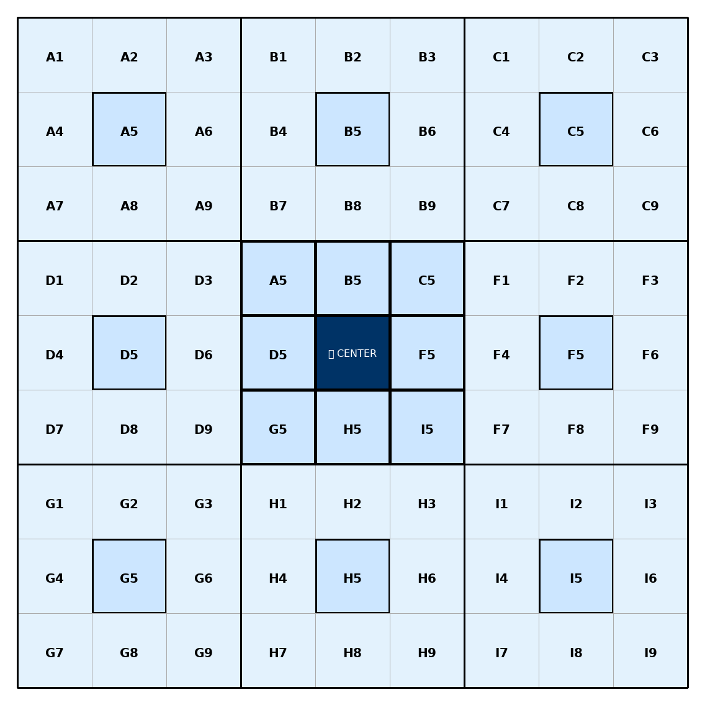

# Mandalart Chart

A simple 9×9 Mandalart chart for organizing one main goal into 8 key areas and 64 detailed actions.

## Preview

## How it works

- **Center**: Main goal.
- **A5–I5**: 8 key themes connected to the center goal.
- **A1–I9**: Detailed ideas, tasks, or action steps for each theme.
- Each 3×3 block expands one theme into smaller, specific items.

## Usage

1. Write your main goal in the center.
2. Fill the 8 surrounding theme cells.
3. Expand each theme into 8 smaller action items.
4. Use the chart as a planning map or progress tracker.

## Files

- `mandalart_chart.png` — image preview of the chart.
- `README.md` — project explanation.
